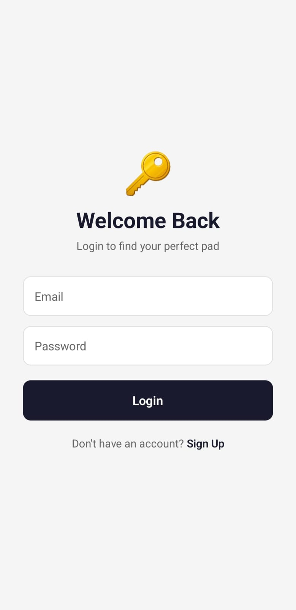
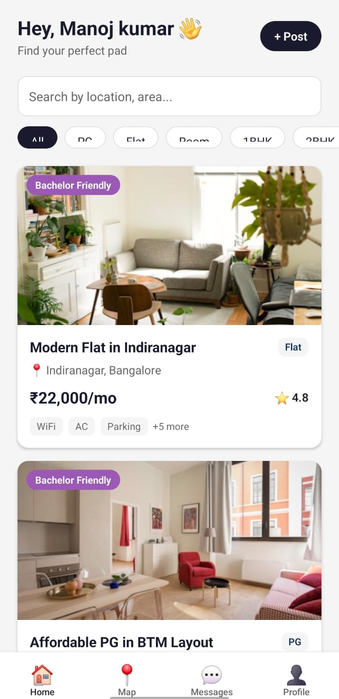
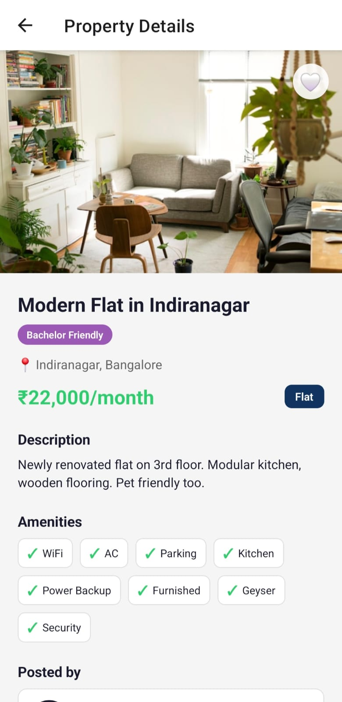
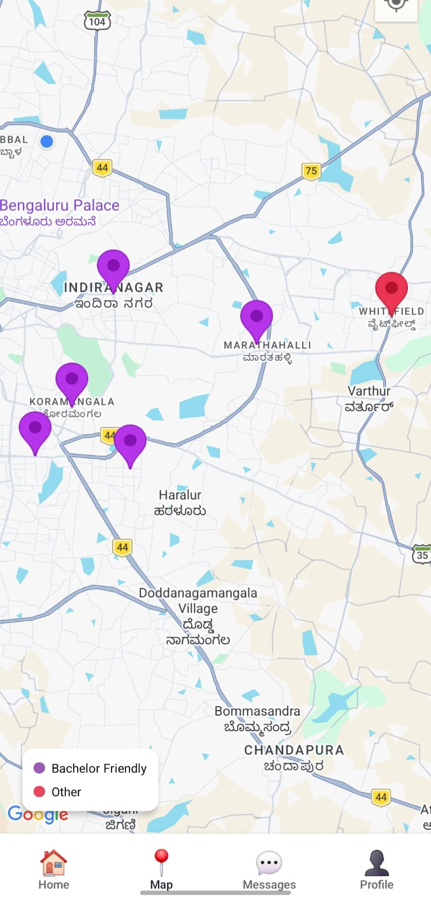

# Bachelor Pad 🏠

   

A mobile app that helps bachelors find PGs, flats, and rooms easily. Built because finding bachelor-friendly housing in India is a real struggle — most landlords don't rent to bachelors, and there's no easy way to filter for it.

## Features

- **Bachelor-Friendly Filter** — Toggle to only see verified bachelor-friendly listings
- **Search & Filters** — Search by location, filter by property type (PG, Flat, Room, 1BHK, 2BHK)
- **Map View** — See all listings on Google Maps with colored markers (purple = bachelor-friendly)
- **Property Details** — Full details with description, amenities, owner info, and photos
- **In-App Chat** — Message property owners directly within the app (real-time with Firebase)
- **Reviews & Ratings** — Read and write reviews for properties
- **Favorites** — Save listings you like for later
- **Post Listings** — Property owners can post their own listings
- **User Authentication** — Email/password signup with owner/tenant roles

## Screenshots

| Welcome | Home | Property | Map |
|---------|------|----------|-----|
|  |  |  |  |

## Tech Stack

| Technology | Purpose |
|---|---|
| React Native (Expo) | Cross-platform mobile app |
| Firebase Auth | User authentication |
| Cloud Firestore | Database for listings, chats, reviews |
| Google Maps | Map view with location markers |
| Expo Location | Get user's current location |
| Expo Router | File-based navigation |

## Project Structure

```
bachelor-pad/
├── app/
│   ├── (tabs)/           # Tab screens (Home, Map, Messages, Profile)
│   ├── property/[id].tsx # Property details page
│   ├── chat/[id].tsx     # Chat screen
│   ├── add-listing.tsx   # Post a new listing
│   ├── login.tsx         # Login page
│   └── signup.tsx        # Signup page
├── components/           # Reusable components (PropertyCard, MapContent)
├── config/               # Firebase configuration
├── context/              # Auth context provider
├── constants/            # Colors and theme
├── utils/                # Helper functions
└── scripts/              # Seed data for demo
```

## Getting Started

### Prerequisites
- Node.js installed
- Expo Go app on your phone (from Play Store / App Store)
- Firebase project with Auth and Firestore enabled

### Setup

1. Clone the repo
```bash
git clone https://github.com/manojkumar-ra/bachelor-pad.git
cd bachelor-pad
```

2. Install dependencies
```bash
npm install
```

3. Update Firebase config in `config/firebase.ts` with your own keys

4. Start the app
```bash
npx expo start
```

5. Scan the QR code with Expo Go on your phone

## Firebase Setup

1. Create a project at [Firebase Console](https://console.firebase.google.com)
2. Enable **Email/Password** and **Google** sign-in under Authentication
3. Create a **Cloud Firestore** database in test mode
4. Add a web app and copy the config to `config/firebase.ts`

## License

MIT
